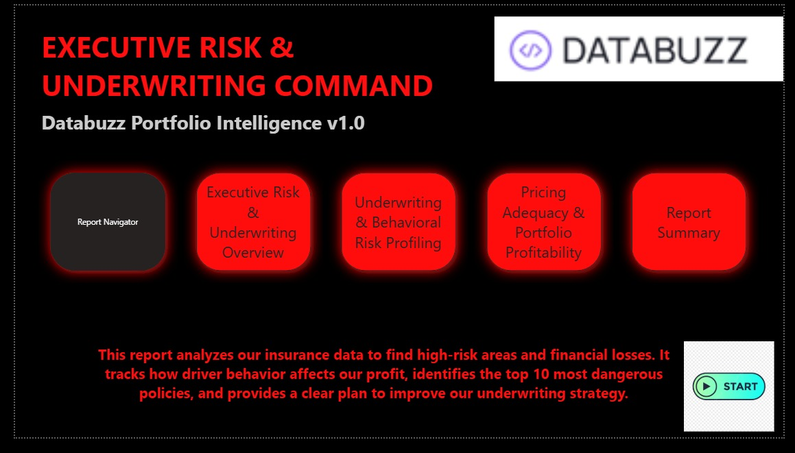
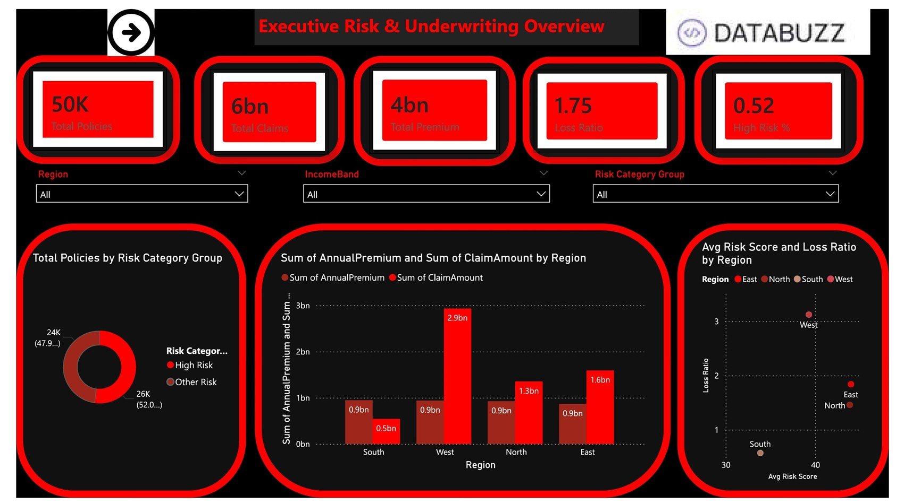
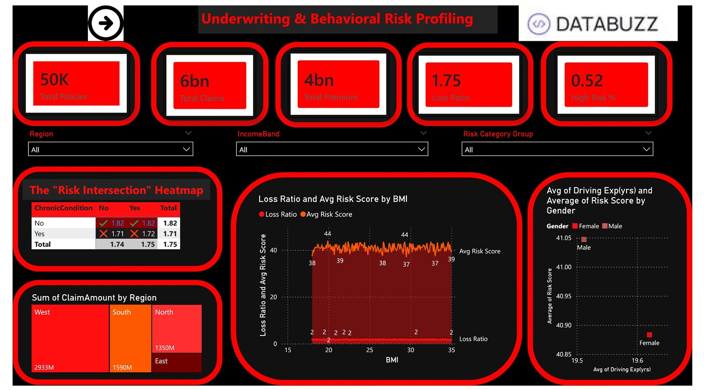
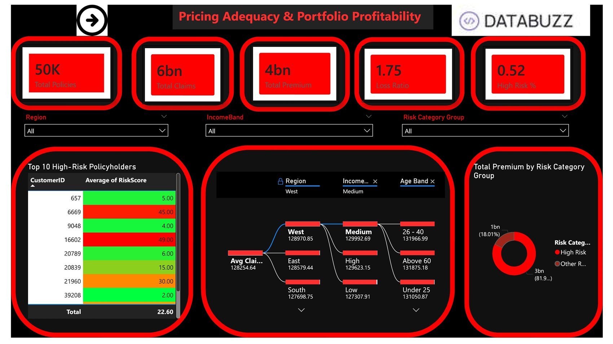
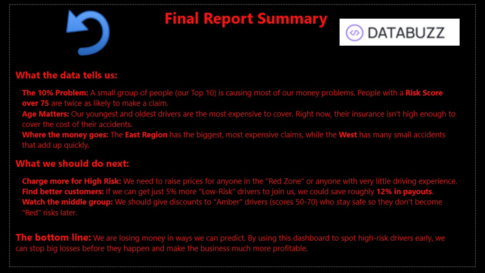
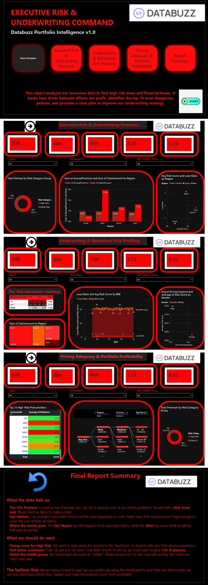

# Executive Risk & Underwriting Command Center

This repository contains the **Executive Risk & Underwriting Command Center** dashboard, a tactical roadmap for insurance portfolio intelligence. Built with a high-contrast "Blood Red on Black" aesthetic, this dashboard is designed to identify critical exposure, analyze driver behavior, and optimize pricing adequacy.

---

## 📊 Dashboard Overview

The project is structured into a logical "Mission Control" flow, moving from high-level global pulses to granular profitability deep-dives.

### 1. Landing Page (The Risk Entryway)
The entry point of the report, providing a clear executive summary and intuitive navigation buttons to lead the user through the data story.

### 2. Executive Risk & Underwriting Overview
A macro view of the portfolio health, tracking key KPIs across 50,000 policies. It highlights regional performance and identifies the high-risk segments of the business.

### 3. Underwriting & Behavioral Risk Profiling
A deep dive into the "Why" behind the risk. This page correlates health factors (BMI, Chronic Conditions) and driving experience with loss ratios and risk scores.

### 4. Pricing Adequacy & Portfolio Profitability
The financial "Money Leak" analysis. Featuring a Top 10 High-Risk Policyholders table and a Decomposition Tree to find exactly where claims are spiking by Region, Income, and Age.

### 5. Final Report Summary
A plain-English conclusion page that summarizes statistical findings and provides actionable strategic recommendations for the underwriting team.

---

## 💡 Key Strategic Insights

### 🔴 The "10% Problem" (Risk Concentration)
* **Concentrated Risk**: Analysis confirms that a tiny fraction of policyholders—just **10%**—represent a disproportionate volume of total exposure.
* **The Red Zone**: Policies with a **Risk Score > 75** show a **150% higher claim frequency** than the portfolio average.

### 📉 Demographic & Regional Volatility
* **Age Matters**: Loss ratios are significantly higher in the **Under 25** and **Over 70** age bands, suggesting current premiums do not reflect the true risk of these demographics.
* **Regional Exposure**: The **East Region** exhibits the highest claim severity, while the **West** deals with high-frequency, small-scale incidents that eat away at margins.

### 🎯 Proactive Mitigation
* **The 5% Shift**: If we shift the portfolio mix by just **5%** toward "Low-Risk" income bands, we can reduce the global **Loss Ratio by an estimated 12%**.
* **Behavioral Incentives**: Data shows a statistical floor at **10 years of driving experience**. We recommend implementing "Safe Driver" discounts for this segment to balance the high-risk volatility.

---

## 🛠️ Technical Features

* **UX/UI Design**: Custom high-contrast theme for executive visibility.
* **Navigation**: Intuitive button-based flow with a central "Report Navigator".
* **Advanced Analytics**: Integrated **Decomposition Trees**, **Heatmaps**, and **Top N** rankings with tie-breaker logic.
* **Interactivity**: Sync-slicers and report-page tooltips for seamless drill-through analysis.
* **Security**: Implemented **Row Level Security (RLS)** for regional management access.

---

### **View Full Dashboard Performance**

---
*Developed by Gyanankur Baruah - Portfolio Intelligence v1.0*
